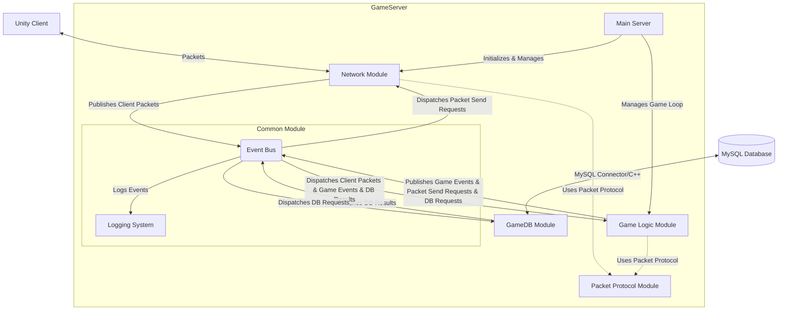

# 🏛️ ArcCore 프로젝트 아키텍처 설계

## 1. 개요

`ArcCore`는 C++ 기반의 고성능 MMORPG 게임 서버 포트폴리오 프로젝트입니다. 본 문서는 `ArcCore` 서버의 아키텍처를 정의하며, 안정적인 동시 접속 처리와 효율적인 게임 데이터 관리를 위한 이벤트 드리븐 아키텍처에 중점을 둡니다. 이는 컴포넌트 간의 낮은 결합도와 높은 확장성을 목표로 합니다.

## 2. 설계 목표 및 원칙

* **고성능**: IOCP 기반 비동기 I/O 모델과 이벤트 버스를 활용하여 낮은 응답 시간을 보장합니다.
* **안정성**: 견고한 에러 처리 및 로깅을 통해 안정적인 서비스를 제공하고, 이벤트 기반으로 장애 전파를 최소화합니다.
* **확장성**: 느슨하게 결합된 컴포넌트 구조로 기능 추가 및 변경이 용이하며 시스템 확장이 유연합니다.
* **유지보수성**: 각 모듈의 명확한 역할 분리와 이벤트 인터페이스를 통해 코드 가독성 및 유지보수성을 높입니다.
* **단일 책임 원칙 (SRP)**: 각 모듈은 하나의 명확한 책임만을 가집니다.

## 3. 시스템 아키텍처 개요

`ArcCore` 서버는 클라이언트 요청 처리, 게임 로직 수행, 데이터베이스 연동을 담당합니다. 모든 내부 컴포넌트 간 통신은 `Common` 모듈 내의 이벤트 버스(Event Bus) 를 통해 비동기적으로 이루어집니다.

## 4. 주요 모듈 및 역할

### 4.1. Common 모듈

* **역할**: 프로젝트 전반에 걸쳐 사용되는 공통 기능, 유틸리티, 자료 구조 및 핵심 인터페이스를 정의합니다. 시스템의 심장부인 이벤트 버스를 포함하며, 모든 모듈 간의 통신을 중재합니다.
* **포함 기능**:
    * **이벤트 버스 (Event Bus)**: 발행-구독(Publish-Subscribe) 패턴을 구현하여 모듈 간의 비동기적이고 느슨한 결합 통신을 지원합니다. 모든 중요한 시스템 이벤트와 게임 로직 이벤트가 이 버스를 통해 전달됩니다.
    * **로깅 (Logging)**: `spdlog` 기반의 고성능 로깅 시스템을 제공하여 서버의 모든 동작, 오류, 디버그 정보를 기록합니다.
    * **공통 유틸리티**: 시간 관리, 자료구조(예: Lock-Free 큐, 오브젝트 풀) 등 범용적으로 사용되는 헬퍼 함수 및 클래스를 정의합니다.
    * **쓰레딩 유틸리티**: 스레드 로컬 저장소, 스레드 풀 관리 등 멀티쓰레딩 환경에서 필요한 유틸리티를 제공합니다.
    * **상수/타입/매크로**: 프로젝트 전반에 걸쳐 공통적으로 사용될 매직 넘버를 대체하는 전역 상수, 특정 목적을 위한 타입 별칭, 매크로 등을 정의합니다.

### 4.2. Network 모듈

* **역할**: 클라이언트와의 네트워크 통신을 전담합니다. IOCP 기반의 비동기 I/O 모델을 사용하여 다수의 동시 접속을 효율적으로 처리합니다.
* **포함 기능**:
    * **IOCP 구현**: 고성능 및 확장성을 위한 윈도우 IOCP(I/O Completion Port) 모델을 사용합니다.
    * **세션 관리**: 접속한 클라이언트별 세션을 생성하고 관리하며, 연결/연결 해제 및 데이터 송수신을 담당합니다.
    * **패킷 처리**: Google Protobuf를 사용하여 클라이언트로부터 수신된 데이터를 역직렬화하고, 서버에서 클라이언트로 전송할 데이터를 직렬화합니다.
    * **이벤트 발행**: 패킷 수신 시 `Common` 모듈의 이벤트 버스를 통해 해당 패킷 수신 이벤트를 발행하여 `GameLogic` 또는 다른 관련 모듈에 전달합니다.
    * **이벤트 구독**: 다른 모듈(주로 `GameLogic`)로부터 네트워크 전송 요청 이벤트를 구독하여 실제 클라이언트로 데이터를 전송합니다.

### 4.3. GameLogic 모듈

* **역할**: 게임의 핵심 로직을 수행합니다. 클라이언트의 요청을 처리하고, 게임 월드 상태를 관리하며, 게임 규칙에 따라 플레이어와 아이템 등의 상호작용을 처리합니다.
* **포함 기능**:
    * **게임 월드 관리**: 플레이어, 몬스터, 아이템 등 모든 게임 오브젝트의 상태 및 위치 정보를 관리합니다.
    * **이벤트 구독/발행**: `Network` 모듈로부터 수신된 클라이언트 패킷 이벤트를 구독하여 처리하고, 처리 결과를 다시 `Network` 모듈로 전송하기 위한 이벤트를 발행합니다. 또한, 내부 게임 상태 변화에 따른 다양한 게임 도메인 이벤트를 발행합니다.
    * **NPC/AI 로직**: NPC의 행동 패턴, AI 계산 등을 담당합니다.
    * **스킬/전투 로직**: 플레이어 및 몬스터 간의 전투 시스템, 스킬 사용 및 효과 등을 처리합니다.
    * **재화/인벤토리 관리**: 게임 내 재화, 아이템 획득 및 사용, 인벤토리 관리 등을 담당합니다.
    * **비즈니스 로직 처리**: 게임의 모든 규칙과 상호작용이 여기서 처리됩니다.

### 4.4. GameDB 모듈

* **역할**: 게임 데이터를 데이터베이스(MySQL)에 영속적으로 저장하고 로드하는 역할을 전담합니다.
* **포함 기능**:
    * **데이터베이스 연동**: MySQL Connector/C++ 라이브러리를 사용하여 MySQL 8.0 데이터베이스에 직접 연결하고 최적화된 SQL 쿼리를 실행합니다.
    * **비동기 DB 처리**: 데이터베이스 I/O 작업이 메인 스레드를 블로킹하지 않도록 비동기 처리 메커니즘을 사용합니다.
    * **DB 커넥션 풀**: 데이터베이스 연결을 효율적으로 관리하고 재사용하여 성능 오버헤드를 줄입니다.
    * **이벤트 구독/발행**: `GameLogic` 모듈로부터 데이터 저장/로드 요청 이벤트를 구독하고, DB 작업 완료 후 결과를 `GameLogic` 모듈로 통보하는 이벤트를 발행합니다.

### 4.5. PacketProtocol 모듈

* **역할**: Google Protobuf를 사용하여 정의된 `.proto` 파일들과 이를 통해 자동으로 생성된 C++ 패킷 클래스를 관리합니다. 네트워크 및 게임 로직 모듈에서 사용되는 패킷 관련 범용 이벤트 클래스(예: `ClientPacketReceivedEvent`, `NetworkSendRequestEvent`)를 정의합니다.

## 5. 스레드 모델

`ArcCore` 서버는 효율적인 자원 사용과 높은 처리량을 위해 다음과 같은 멀티스레드 모델을 채택합니다. 각 스레드 그룹은 특정 역할에 집중하여 성능 병목 현상을 최소화하고 시스템의 안정성을 높입니다.

### 5.1. 메인 스레드 (Main Thread)

* **역할**: 서버의 초기화 및 종료를 담당하며, 주요 이벤트 루프를 관리합니다. 주기적인 작업(예: 게임 월드 업데이트, 타이머 이벤트 처리)을 처리하며, 블로킹되는 작업이 없도록 설계됩니다.
* **담당 모듈**: `MainServer`의 엔트리 포인트 및 전반적인 서버 생명주기 관리.
* **특징**: 모든 I/O 및 데이터베이스 작업은 다른 스레드 풀로 위임하여 이 스레드가 항상 반응성을 유지하도록 합니다.

### 5.2. 네트워크 워커 스레드 풀 (Network Worker Thread Pool)

* **역할**: `Network` 모듈의 핵심 스레드로, IOCP로부터 완료된 I/O 작업(패킷 수신, 패킷 전송 완료)을 처리합니다. 수신된 패킷을 역직렬화하고 `Common` 모듈의 이벤트 버스를 통해 관련 이벤트를 발행합니다.
* **구성**: 일반적으로 서버의 CPU 코어 수에 맞춰 스레드 수를 설정하는 것이 효율적입니다. IOCP는 OS 커널 레벨에서 효율적으로 스레드를 관리합니다.
* **통신**: `Network` 모듈은 이 스레드 풀을 통해 IOCP 이벤트를 처리하고, `GameLogic` 모듈로의 패킷 이벤트를 `EventBus`에 발행합니다. 또한 `GameLogic` 모듈에서 발생한 네트워크 전송 요청 이벤트를 `EventBus`로부터 구독하여 처리합니다.

### 5.3. 게임 로직 스레드 (Game Logic Thread)

* **역할**: `GameLogic` 모듈의 이벤트를 구독하여 실제 게임 로직(플레이어 이동, 전투 계산, 아이템 처리 등)을 수행합니다. MMORPG의 복잡한 월드 상태와 플레이어 간 상호작용의 동기화 문제를 최소화하기 위해 단일 스레드에서 모든 핵심 게임 로직을 처리하는 것을 기본으로 합니다.
* **구성**: 단일 스레드로 구성되어 데이터의 동시 접근에 대한 복잡한 락(lock) 및 동기화 메커니즘을 줄여줍니다.
* **통신**: `EventBus`로부터 클라이언트 패킷 수신 이벤트, DB 결과 이벤트 등을 처리하고, 그 결과로 발생하는 게임 도메인 이벤트나 네트워크 전송 요청 이벤트를 다시 `EventBus`에 발행합니다.

### 5.4. 데이터베이스 워커 스레드 풀 (Database Worker Thread Pool)

* **역할**: `GameDB` 모듈에 할당되며, 데이터베이스 쿼리를 비동기적으로 실행하고 결과를 처리합니다.
* **구성**: DB 작업은 I/O 바운드 작업이므로, CPU 코어 수와는 별개로 동시에 처리해야 할 DB 요청 수에 따라 스레드 수를 조절하여 커넥션 풀과 함께 운용합니다.
* **통신**: `GameLogic` 모듈로부터 DB 요청 이벤트를 구독하고, SQL 쿼리를 실행한 후, 결과 이벤트를 생성하여 `EventBus`에 발행합니다.

### 5.5. 로깅 스레드 (Logging Thread)

* **역할**: `spdlog`와 같은 고성능 로깅 라이브러리의 비동기 기능을 활용하여, 별도의 스레드에서 로그 메시지를 파일이나 콘솔에 기록합니다. 이를 통해 메인 스레드나 다른 워커 스레드의 성능에 영향을 주지 않습니다.
* **구성**: 일반적으로 단일 스레드로 충분하며, 로그 메시지를 비동기 큐에 쌓아두고 이 스레드에서 처리합니다.

### 5.6. 스레드 간 통신 전략

* **이벤트 버스 (Event Bus)**: 모든 모듈 간의 통신은 `Common` 모듈의 이벤트 버스를 통해 이루어집니다. 이벤트 버스는 발행-구독 패턴을 사용하여 스레드 간의 느슨한 결합 통신을 지원하며, 각 스레드는 관심 있는 이벤트를 구독하고 처리합니다.
* **스레드-안전한 큐/컨테이너**: 이벤트 버스 내부적으로는 스레드-안전한 큐(Lock-Free 큐 등)를 사용하여 이벤트를 전달하며, 다른 공유 자원에 접근할 때는 적절한 동기화 메커니즘(뮤텍스, 세마포어 등)을 사용합니다.

## 6. 데이터 흐름 (플레이어 이동)

플레이어 이동 요청을 예시로 이벤트 버스를 통한 데이터 흐름을 스레드 관점에서 설명합니다.

1.  **클라이언트 -> Network (네트워크 워커 스레드 풀):** Unity 클라이언트가 이동 패킷(`C_MOVE_PACKET`)을 서버로 전송합니다. `Network` 모듈의 네트워크 워커 스레드 풀 중 하나가 이 패킷을 수신하고 역직렬화합니다.
2.  **Network (네트워크 워커 스레드) -> EventBus:** 수신 및 역직렬화가 완료되면, 해당 네트워크 워커 스레드는 `PacketProtocol`에 정의된 클라이언트 패킷 수신 이벤트를 생성하여 `EventBus`에 발행합니다.
3.  **EventBus -> GameLogic (게임 로직 스레드):** `EventBus`는 클라이언트 패킷 수신 이벤트를 `GameLogic` 모듈의 게임 로직 스레드에 등록된 핸들러에게 전달합니다. 게임 로직 스레드는 이 이벤트를 받아 게임 도메인 이벤트로 변환 (예: `PlayerMoveRequestEvent`)하여 다시 `EventBus`에 재발행합니다.
4.  **GameLogic (게임 로직 스레드):**
    * 게임 로직 스레드는 `PlayerMoveRequestEvent`와 같은 게임 도메인 이벤트를 구독하여 처리합니다.
    * 이동 유효성 검사 및 플레이어 위치 업데이트를 수행합니다.
    * 이동 완료 후 `PlayerMovedEvent`를 `EventBus`에 발행합니다.
    * 클라이언트에 응답을 위해 응답 패킷(`S_MOVE_PACKET`)을 생성하고, `PacketProtocol`에 정의된 네트워크 전송 요청 이벤트를 생성하여 `EventBus`에 발행합니다. 이 모든 작업은 게임 로직 스레드에서 이루어집니다.
5.  **EventBus -> Network (네트워크 워커 스레드 풀):** `EventBus`는 네트워크 전송 요청 이벤트를 `Network` 모듈로 전달하며, 이는 네트워크 워커 스레드 풀 중 하나에 의해 구독됩니다.
6.  **Network (네트워크 워커 스레드):** 해당 네트워크 워커 스레드는 네트워크 전송 요청 이벤트를 구독하여 내부 패킷을 직렬화하고 해당 클라이언트 세션에 전송합니다.
7.  **GameDB (데이터베이스 워커 스레드 풀):** 만약 플레이어 이동이 특정 조건(예: 지역 변경)에서 데이터베이스 업데이트를 필요로 한다면, `GameLogic` (게임 로직 스레드)은 `GameDB` 모듈에 해당 업데이트 요청 이벤트를 발행하고, `GameDB` 모듈의 데이터베이스 워커 스레드 풀 중 하나가 이를 처리한 후 완료 이벤트를 발행하여 `GameLogic` (게임 로직 스레드)에 통보합니다. 이 경우 `GameDB` 작업은 데이터베이스 워커 스레드에서 비동기적으로 처리되어 메인 스레드를 블로킹하지 않습니다.

---