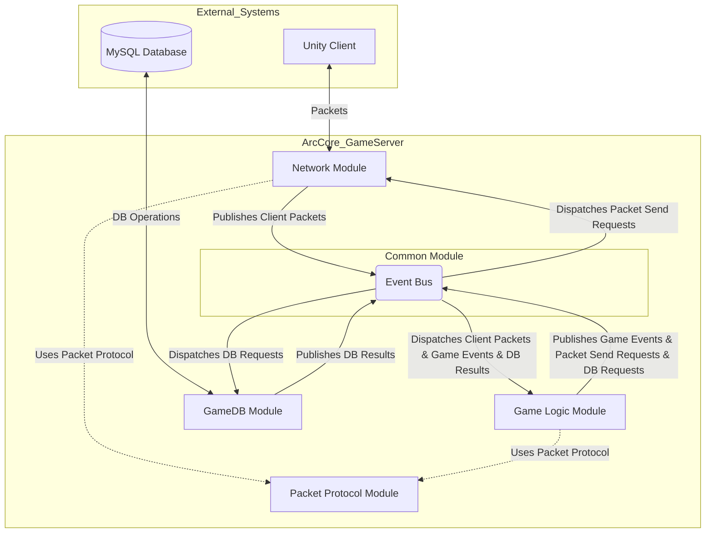

# 🏛️ ArcCore 프로젝트 아키텍처 설계

## 1. 개요

`ArcCore`는 C++ 기반의 고성능 MMORPG 게임 서버 포트폴리오 프로젝트입니다. 본 문서는 `ArcCore` 서버의 아키텍처를 정의하며, 안정적인 동시 접속 처리와 효율적인 게임 데이터 관리를 위한 **이벤트 드리븐 아키텍처**에 중점을 둡니다. 이는 컴포넌트 간의 낮은 결합도와 높은 확장성을 목표로 합니다.

## 2. 설계 목표 및 원칙

* **고성능**: IOCP 기반 비동기 I/O 모델과 이벤트 버스를 활용하여 낮은 응답 시간을 보장합니다.
* **안정성**: 견고한 에러 처리 및 로깅을 통해 안정적인 서비스를 제공하고, 이벤트 기반으로 장애 전파를 최소화합니다.
* **확장성**: 느슨하게 결합된 컴포넌트 구조로 기능 추가 및 변경이 용이하며 시스템 확장이 유연합니다.
* **유지보수성**: 각 모듈의 명확한 역할 분리와 이벤트 인터페이스를 통해 코드 가독성 및 유지보수성을 높입니다.
* **단일 책임 원칙 (SRP)**: 각 모듈은 하나의 명확한 책임만을 가집니다.

## 3. 시스템 아키텍처 개요

`ArcCore` 서버는 클라이언트 요청 처리, 게임 로직 수행, 데이터베이스 연동을 담당합니다. 모든 내부 컴포넌트 간 통신은 `Common` 모듈 내의 **이벤트 버스(Event Bus)** 를 통해 비동기적으로 이루어집니다.

## 4. 주요 컴포넌트 및 역할

각 모듈은 명확한 책임을 가지며 EventBus를 통해 소통합니다.

### 4.1. `MainServer` (Executable)

* **역할**: 서버의 진입점. 모든 라이브러리(Common, Network, PacketProtocol, GameDB, GameLogic)를 링크하고, 서버 초기화 및 메인 루프를 실행합니다.

### 4.2. `Common` (Static Library)

* **역할**: 서버 전반에 걸쳐 공통적으로 사용되는 기반 유틸리티 및 **이벤트 시스템의 핵심 구성 요소**를 제공합니다. 모든 다른 서버 모듈은 `Common` 모듈이 제공하는 기능을 암시적으로 활용합니다.
* **주요 기능**:
    * **EventBus**: 중앙 집중식 이벤트 발행/구독 허브 (스레드-안전한 이벤트 큐 포함).
    * **BaseEvent**: 모든 구체적인 이벤트의 추상 기본 클래스/인터페이스.
    * 메모리 풀, 스레드-안전 자료구조, 로깅 시스템, 타이머 관리 등.

### 4.3. `Network` (Static Library)

* **역할**: IOCP 기반의 비동기 네트워크 통신을 전담합니다. 클라이언트 세션 관리 및 패킷 송수신을 처리합니다.
* **주요 기능**:
    * IOCP 및 Winsock API 래핑, 세션 관리.
    * 수신된 패킷을 `PacketProtocol`에 정의된 **클라이언트 패킷 수신 이벤트**로 변환하여 `EventBus`에 발행.
    * `PacketProtocol`에 정의된 **네트워크 전송 요청 이벤트**를 구독하여 패킷 직렬화 후 클라이언트에 전송.
    * **상위 도메인 모듈(GameLogic, GameDB)에 직접 의존하지 않습니다.**

### 4.4. `PacketProtocol` (Static Library)

* **역할**: Google Protobuf를 사용한 클라이언트-서버 통신 패킷 구조를 정의하고, **네트워크 송수신 관련 범용 이벤트 클래스를 정의**합니다. 이 모듈은 `Common` 모듈의 `BaseEvent`를 사용하지만, 다이어그램에서는 시각적 간결성을 위해 직접적인 `Uses` 화살표는 생략합니다.
* **주요 기능**:
    * `.proto` 파일 정의 및 Protobuf C++ 코드 자동 생성.
    * `Network`와 `GameLogic` 간의 느슨한 결합을 위한 `ClientPacketReceivedEvent<PacketType>` 및 `NetworkSendRequestEvent<PacketType>` 정의.

### 4.5. `GameDB` (Static Library)

* **역할**: MySQL 데이터베이스 연동을 담당하며, 게임 데이터의 영속성 관리를 위한 추상화 계층을 제공합니다.
* **주요 기능**:
    * DB 커넥션 풀, 비동기 쿼리 시스템.
    * `EventBus`로부터 DB 쿼리 요청 이벤트를 구독하여 DB 쿼리 수행.
    * 쿼리 완료 후 결과를 담은 이벤트(e.g., `LoginDBResultEvent`)를 `EventBus`에 발행.

### 4.6. `GameLogic` (Static Library)

* **역할**: 서버의 핵심 게임 규칙과 상태 변화를 처리합니다. `EventBus`를 통해 다양한 이벤트를 구독하고 게임 로직을 수행하며, 게임 상태 변화를 이벤트로 발행합니다.
* **주요 기능**:
    * `PacketProtocol`의 `ClientPacketReceivedEvent`를 구독하여 처리하며, 이를 **게임 도메인 이벤트로 변환하여 재발행** (예: `C_MOVE_PACKET` -> `PlayerMoveRequestEvent`).
    * 게임 로직 수행 후 `PlayerMovedEvent`와 같은 도메인 이벤트 발행.
    * 클라이언트에 응답 시, `PacketProtocol`의 `NetworkSendRequestEvent`를 생성하여 `EventBus`에 발행.
    * 전투, 인벤토리, 채팅, 몬스터, NPC, 퀘스트 등 다양한 게임 시스템 구현.

## 5. 이벤트 버스 (핵심 요소)

* **역할**: `Common` 모듈 내에 구현된 `ArcCore` 아키텍처의 중심축으로, 모든 컴포넌트 간의 비동기 통신을 담당합니다. 이벤트를 발행하고, 해당 이벤트를 구독하는 모든 핸들러에게 전달합니다.
* **구현**: 싱글톤 패턴으로 구현되며, 내부에 스레드-안전한 이벤트 큐를 유지하여 발행/소비를 분리합니다. `BaseEvent` 타입을 기반으로 동작하여 구체적인 이벤트 타입에는 의존하지 않습니다.

## 6. 데이터 흐름 (플레이어 이동)

1.  **클라이언트 -> Network**: Unity 클라이언트가 이동 패킷(`C_MOVE_PACKET`)을 서버로 전송.
2.  **Network 모듈**: 패킷 수신 및 역직렬화 후, `PacketProtocol`에 정의된 **클라이언트 패킷 수신 이벤트**를 생성하여 `EventBus`에 발행.
3.  **EventBus -> GameLogic**: 클라이언트 패킷 수신 이벤트를 `GameLogic`의 핸들러에게 전달. `GameLogic`은 이벤트를 받아 **게임 도메인 이벤트로 변환** (예: `PlayerMoveRequestEvent`)하여 다시 `EventBus`에 재발행.
4.  **GameLogic 모듈**:
    * `PlayerMoveRequestEvent`와 같은 게임 도메인 이벤트를 구독하여 처리. (선택적으로 성능 최적화를 위해 직접 호출 가능)
    * 이동 유효성 검사 및 위치 업데이트 수행.
    * 이동 완료 후 `PlayerMovedEvent`를 `EventBus`에 발행.
    * 클라이언트에 응답을 위해 응답 패킷(`S_MOVE_PACKET`)을 생성하고, `PacketProtocol`에 정의된 **네트워크 전송 요청 이벤트**를 생성하여 `EventBus`에 발행.
5.  **EventBus -> Network**: 네트워크 전송 요청 이벤트를 `Network` 모듈로 전달.
6.  **Network 모듈**: 네트워크 전송 요청 이벤트를 구독. 내부 패킷을 직렬화하여 해당 클라이언트 세션에 전송.
7.  **GameDB 모듈 (선택적)**: `GameLogic`이 `SavePlayerLocationRequestEvent`를 발행하면, `GameDB`가 구독하여 DB 작업 수행 후 `PlayerLocationSavedEvent` 발행.

## 7. 스레드 모델

`ArcCore` 서버는 IOCP 기반의 비동기 I/O와 이벤트 기반 스레드 처리를 결합한 모델을 사용합니다.

* **I/O 스레드**: `Network` 모듈에서 IOCP 이벤트를 처리하고, 수신 데이터를 패킷화하여 `EventBus`에 발행.
* **메인 게임 로직 스레드**: 대부분의 게임 로직 이벤트를 `EventBus`로부터 구독하여 순차적으로 처리, 게임 상태 일관성 유지.
* **DB 스레드 풀**: `GameDB` 모듈에서 DB 요청 이벤트를 구독하여 비동기 DB 작업 수행 후 DB 결과 이벤트를 발행.

## 8. 빌드 및 배포 아키텍처

* **vcpkg**: 외부 라이브러리(spdlog, Protobuf, MySQL Connector 등) 의존성을 `vcpkg.json`으로 관리.
* **Visual Studio Solution**: 모든 서버 프로젝트 통합 관리 및 빌드.
* **CI/CD (향후)**: GitHub Actions 등을 통한 자동 빌드, 테스트, 배포 파이프라인 구축 고려.