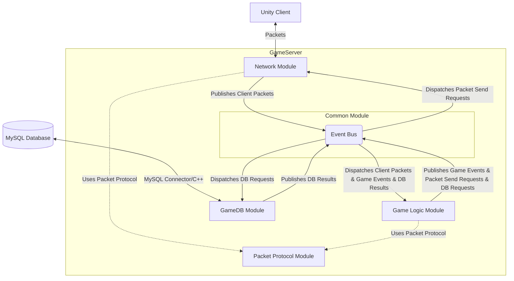

# 🏛️ ArcCore 프로젝트 아키텍처 설계

## 1. 개요

`ArcCore`는 C++ 기반의 고성능 MMORPG 게임 서버 포트폴리오 프로젝트입니다. 본 문서는 `ArcCore` 서버의 아키텍처를 정의하며, 안정적인 동시 접속 처리와 효율적인 게임 데이터 관리를 위한 **이벤트 드리븐 아키텍처**에 중점을 둡니다. 이는 컴포넌트 간의 낮은 결합도와 높은 확장성을 목표로 합니다.

## 2. 설계 목표 및 원칙

* **고성능**: IOCP 기반 비동기 I/O 모델과 이벤트 버스를 활용하여 낮은 응답 시간을 보장합니다.
* **안정성**: 견고한 에러 처리 및 로깅을 통해 안정적인 서비스를 제공하고, 이벤트 기반으로 장애 전파를 최소화합니다.
* **확장성**: 느슨하게 결합된 컴포넌트 구조로 기능 추가 및 변경이 용이하며 시스템 확장이 유연합니다.
* **유지보수성**: 각 모듈의 명확한 역할 분리와 이벤트 인터페이스를 통해 코드 가독성 및 유지보수성을 높입니다.
* **단일 책임 원칙 (SRP)**: 각 모듈은 하나의 명확한 책임만을 가집니다.

## 3. 시스템 아키텍처 개요

`ArcCore` 서버는 클라이언트 요청 처리, 게임 로직 수행, 데이터베이스 연동을 담당합니다. 모든 내부 컴포넌트 간 통신은 `Common` 모듈 내의 **이벤트 버스(Event Bus)** 를 통해 비동기적으로 이루어집니다.

## 4. 주요 모듈 및 역할

### 4.1. Common 모듈

* **역할**: 프로젝트 전반에 걸쳐 사용되는 공통 기능, 유틸리티, 자료 구조 및 핵심 인터페이스를 정의합니다. 시스템의 심장부인 **이벤트 버스**를 포함하며, 모든 모듈 간의 통신을 중재합니다.
* **포함 기능**:
    * **이벤트 버스 (Event Bus)**: 발행-구독(Publish-Subscribe) 패턴을 구현하여 모듈 간의 비동기적이고 느슨한 결합 통신을 지원합니다. 모든 중요한 시스템 이벤트와 게임 로직 이벤트가 이 버스를 통해 전달됩니다.
    * **로깅 (Logging)**: `spdlog` 기반의 고성능 로깅 시스템을 제공하여 서버의 모든 동작, 오류, 디버그 정보를 기록합니다.
    * **공통 유틸리티**: 시간 관리, 자료구조(예: Lock-Free 큐, 오브젝트 풀) 등 범용적으로 사용되는 헬퍼 함수 및 클래스를 정의합니다.
    * **쓰레딩 유틸리티**: 스레드 로컬 저장소, 스레드 풀 관리 등 멀티쓰레딩 환경에서 필요한 유틸리티를 제공합니다.
    * **상수/타입/매크로**: 프로젝트 전반에 걸쳐 공통적으로 사용될 매직 넘버를 대체하는 전역 상수, 특정 목적을 위한 타입 별칭, 매크로 등을 정의합니다.

### 4.2. Network 모듈

* **역할**: 클라이언트와의 네트워크 통신을 전담합니다. IOCP 기반의 비동기 I/O 모델을 사용하여 다수의 동시 접속을 효율적으로 처리합니다.
* **포함 기능**:
    * **IOCP 구현**: 고성능 및 확장성을 위한 윈도우 IOCP(I/O Completion Port) 모델을 사용합니다.
    * **세션 관리**: 접속한 클라이언트별 세션을 생성하고 관리하며, 연결/연결 해제 및 데이터 송수신을 담당합니다.
    * **패킷 처리**: Google Protobuf를 사용하여 클라이언트로부터 수신된 데이터를 역직렬화하고, 서버에서 클라이언트로 전송할 데이터를 직렬화합니다.
    * **이벤트 발행**: 패킷 수신 시 `Common` 모듈의 이벤트 버스를 통해 해당 패킷 수신 이벤트를 발행하여 `GameLogic` 또는 다른 관련 모듈에 전달합니다.
    * **이벤트 구독**: 다른 모듈(주로 `GameLogic`)로부터 네트워크 전송 요청 이벤트를 구독하여 실제 클라이언트로 데이터를 전송합니다.

### 4.3. GameLogic 모듈

* **역할**: 게임의 핵심 로직을 수행합니다. 클라이언트의 요청을 처리하고, 게임 월드 상태를 관리하며, 게임 규칙에 따라 플레이어와 아이템 등의 상호작용을 처리합니다.
* **포함 기능**:
    * **게임 월드 관리**: 플레이어, 몬스터, 아이템 등 모든 게임 오브젝트의 상태 및 위치 정보를 관리합니다.
    * **이벤트 구독/발행**: `Network` 모듈로부터 수신된 클라이언트 패킷 이벤트를 구독하여 처리하고, 처리 결과를 다시 `Network` 모듈로 전송하기 위한 이벤트를 발행합니다. 또한, 내부 게임 상태 변화에 따른 다양한 게임 도메인 이벤트를 발행합니다.
    * **NPC/AI 로직**: NPC의 행동 패턴, AI 계산 등을 담당합니다.
    * **스킬/전투 로직**: 플레이어 및 몬스터 간의 전투 시스템, 스킬 사용 및 효과 등을 처리합니다.
    * **재화/인벤토리 관리**: 게임 내 재화, 아이템 획득 및 사용, 인벤토리 관리 등을 담당합니다.
    * **비즈니스 로직 처리**: 게임의 모든 규칙과 상호작용이 여기서 처리됩니다.

### 4.4. GameDB 모듈

* **역할**: 게임 데이터를 데이터베이스(MySQL)에 영속적으로 저장하고 로드하는 역할을 전담합니다.
* **포함 기능**:
    * **데이터베이스 연동**: MySQL Connector/C++ 라이브러리를 사용하여 MySQL 8.0 데이터베이스에 직접 연결하고 최적화된 SQL 쿼리를 실행합니다.
    * **비동기 DB 처리**: 데이터베이스 I/O 작업이 메인 스레드를 블로킹하지 않도록 비동기 처리 메커니즘을 사용합니다. 별도의 DB 워커 스레드 풀을 통해 요청을 처리하고 결과를 이벤트 버스를 통해 다시 발행합니다.
    * **이벤트 구독/발행**: `GameLogic` 모듈로부터 데이터 저장/로드 요청 이벤트를 구독하고, DB 작업 완료 후 결과를 `GameLogic` 모듈로 통보하는 이벤트를 발행합니다.

## 5. 이벤트 버스를 통한 모듈 간 통신

`ArcCore`의 핵심 아키텍처는 **이벤트 버스**를 중심으로 모듈들이 느슨하게 결합되어 통신하는 방식입니다.

* **낮은 결합도**: 각 모듈은 특정 이벤트에만 의존하며, 다른 모듈의 내부 구현에 직접적으로 의존하지 않습니다.
* **높은 확장성**: 새로운 기능을 추가할 때 기존 모듈을 수정하는 대신, 새로운 모듈을 추가하거나 기존 모듈에서 발행하는 이벤트를 구독하여 쉽게 확장할 수 있습니다.
* **비동기 처리**: 이벤트 발행 시 즉시 처리되지 않고, 이벤트 핸들러가 별도의 스레드나 다음 이벤트 루프에서 처리될 수 있어 블로킹을 최소화하고 성능을 향상시킵니다.
* **명확한 책임 분리**: 각 모듈은 자신의 핵심 책임에만 집중하며, 다른 모듈의 특정 함수를 직접 호출하는 대신 이벤트를 발행하여 메시지를 전달합니다.

## 6. 데이터 흐름 (플레이어 이동)

플레이어 이동 요청을 예시로 이벤트 버스를 통한 데이터 흐름을 설명합니다.

1.  **클라이언트 -> Network**: Unity 클라이언트가 이동 패킷(`C_MOVE_PACKET`)을 서버로 전송합니다.
2.  **Network 모듈**: 패킷 수신 및 역직렬화 후, `PacketProtocol`에 정의된 **클라이언트 패킷 수신 이벤트**를 생성하여 `EventBus`에 발행합니다.
3.  **EventBus -> GameLogic**: 클라이언트 패킷 수신 이벤트를 `GameLogic`의 핸들러에게 전달. `GameLogic`은 이벤트를 받아 **게임 도메인 이벤트로 변환** (예: `PlayerMoveRequestEvent`)하여 다시 `EventBus`에 재발행합니다.
4.  **GameLogic 모듈**:
    * `PlayerMoveRequestEvent`와 같은 게임 도메인 이벤트를 구독하여 처리. (선택적으로 성능 최적화를 위해 직접 호출 가능)
    * 이동 유효성 검사 및 위치 업데이트 수행.
    * 이동 완료 후 `PlayerMovedEvent`를 `EventBus`에 발행.
    * 클라이언트에 응답을 위해 응답 패킷(`S_MOVE_PACKET`)을 생성하고, `PacketProtocol`에 정의된 **네트워크 전송 요청 이벤트**를 생성하여 `EventBus`에 발행합니다.
5.  **EventBus -> Network**: 네트워크 전송 요청 이벤트를 `Network` 모듈로 전달.
6.  **Network 모듈**: 네트워크 전송 요청 이벤트를 구독. 내부 패킷을 직렬화하여 해당 클라이언트 세션에 전송.
7.  **GameDB 모듈**: 만약 플레이어 이동이 특정 조건(예: 지역 변경)에서 데이터베이스 업데이트를 필요로 한다면, `GameLogic`은 `GameDB` 모듈에 해당 업데이트 요청 이벤트를 발행하고, `GameDB`는 이를 처리한 후 완료 이벤트를 발행하여 `GameLogic`에 통보합니다. 이 경우 `GameDB`는 메인 스레드를 블로킹하지 않도록 비동기적으로 처리됩니다.